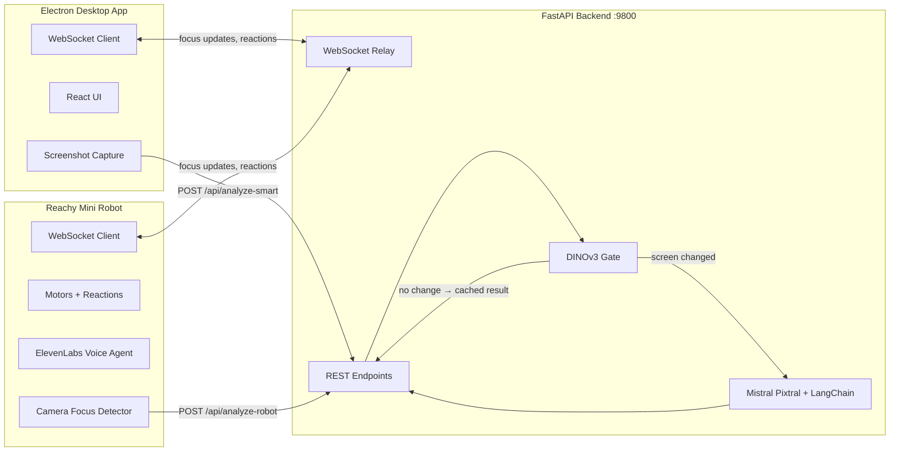

Video: https://www.youtube.com/watch?v=m1lMSnCx464

# Pabu Focus

An AI-powered focus coach that combines a desktop app, a vision-language model pipeline, and a physical robot companion to keep you on task. It watches your screen and your body, detects distractions in real time, and nudges you back — through on-screen overlays, a conversational voice agent, and a Reachy Mini robot that physically reacts to your attention state.

---

## How It Works

1. You create a task (optionally with AI-generated todo breakdowns) and start a focus session.
2. Every 5 seconds the desktop app captures a screenshot and sends it to the backend along with active window metadata and keyboard/mouse activity metrics.
3. The backend runs a two-stage analysis: a fast DINOv3 similarity gate decides whether the screen actually changed, and only then calls Mistral Pixtral for a task-aware focus judgment.
4. If you're distracted: a full-screen overlay appears with refocus suggestions, the robot reacts physically (warning head movements, antenna animations), and the voice agent can intervene conversationally.
5. When you're focused: the robot nods approvingly and the app tracks your focus score over time.

---

## Architecture

**Communication channels:**

| Channel | Purpose |
|---------|---------|
| REST (`/api/*`) | Screenshot analysis, todo generation, TTS, resource suggestions |
| WebSocket (`/ws/desktop`, `/ws/robot`) | Real-time relay of focus state, reactions, and voice events between desktop and robot |
| Electron IPC | Screenshot capture, active window info, native notifications |

---

## The AI Pipeline

### DINOv3 Gate — Skip Redundant LLM Calls

The most expensive operation is sending a screenshot to Mistral Pixtral. Most of the time the screen hasn't meaningfully changed between captures. DINOv3 acts as a fast semantic gate that decides whether an LLM call is needed at all.

**What the trigger system does:**

1. **Capture the screen** — Uses `mss` to grab frames from a selected monitor. Optionally downsamples for speed while keeping dimensions aligned to the model's stride.
2. **Compute DINOv3 patch embeddings** — A DINOv3 vision model (via Hugging Face `transformers`) produces a feature vector per spatial patch. Runs on `cuda` (Windows/NVIDIA), Apple Silicon `mps`, or CPU.
3. **Compute a scroll-resistant "screen change" statistic** — Compares each patch to the best match *within its column* in the previous frame (not the same position, which breaks during scrolling).
4. **Trigger logic** — When the change statistic exceeds a threshold for N consecutive frames (and not within a cooldown window), the screen is considered meaningfully changed and the LLM is called. Otherwise the cached result is returned.

**How the trigger score is computed:**

**Step A — Patch embeddings.** For each frame `t`, the model outputs `last_hidden_state` with shape `(T, D)`. Some of those `T` tokens are special tokens (CLS / register tokens); the rest correspond to spatial patches arranged in an `R x C` grid. The code infers the **stride** (e.g. 16 for ViT-S/16) and **number of special tokens** by matching `T - n_special = R * C` given the image dimensions. Each patch embedding is L2-normalized so cosine similarity becomes a dot product:

$$
\hat{x}_{t,i} = \frac{x_{t,i}}{\lVert x_{t,i}\rVert_2 + \epsilon}
$$

**Step B — Column-wise best match (scroll-resistant).** If the user scrolls vertically, content shifts up/down. A strict same-index comparison would report a large change even when the same content is still on screen. To handle this, each patch in the current frame `t` is compared to the **best matching patch in the previous frame `t-1`** within the same column and a vertical window of `[-K, K]`:

$$
s^{col}_{t,r,c} = \max_{\Delta \in [-K, K]\ \mathrm{valid}} \hat{x}_{t,r,c}^{\top}\hat{x}_{t-1,r+\Delta,c}
$$

The per-patch similarities are then averaged over the full grid:

$$
\overline{s}^{col}_t = \frac{1}{RC}\sum_{r=1}^{R}\sum_{c=1}^{C} s^{col}_{t,r,c}
$$

Finally, similarity is converted into a change score:

$$
\mathrm{dino\_col\_change}_t = 1 - \overline{s}^{col}_t
$$

**Interpretation:**
- **Near 0** — screen is very similar to the previous frame (possibly after a small scroll). Cached focus result is returned.
- **Larger values** — screen content changed meaningfully. LLM analysis is triggered.

The window size `K` is configurable (`DINO_SCROLL_K`). Larger `K` tolerates more scroll but costs more compute.

### Mistral Pixtral Vision

When the screen *has* changed, the screenshot is sent to `pixtral-12b-2409` with the user's current task and todo as context. The model returns a focus judgment (focused / distracted / idle) with confidence and reasoning.

### LangChain Synthesis

A synthesis chain merges the vision result with window metadata (app name, title) and activity metrics (keypress rate, mouse movement, idle time) into a final decision. This catches edge cases like "user is on a code editor but hasn't typed in 2 minutes."

### Fallback Hierarchy

Every LLM call has graceful degradation: **AWS Bedrock** (primary) → **Mistral API** (fallback) → **rule-based heuristics** (app name matching, activity thresholds).

### Rust Image Comparison (Fast Path)

A custom Rust crate in `backend/image_comparison_metrics/fast/` provides SSIM, histogram, and hybrid image similarity metrics as a lightweight alternative to the DINOv3 path.

---

## Tech Stack

| Layer | Technologies |
|-------|-------------|
| **Desktop** | Electron 40, React 18, TypeScript, Framer Motion, Recharts, Lucide icons |
| **Backend** | Python, FastAPI, Uvicorn, LangChain |
| **AI / Vision** | Mistral Pixtral 12B (vision), Mistral Large (text), AWS Bedrock, DINOv2 (PyTorch + HuggingFace) |
| **Voice** | ElevenLabs TTS + Conversational AI Agent (Python SDK on robot, React SDK on desktop) |
| **Robot** | Reachy Mini (Pollen Robotics) — motors, camera, antenna; simulation mode for development |
| **Image Comparison** | Rust crate: SSIM, histogram, hybrid scoring |

---

## Key Features

| Feature | Description |
|---------|-------------|
| **Multi-modal focus detection** | Screen content + physical presence (robot camera) + keyboard/mouse activity |
| **Task-aware analysis** | The LLM knows your current task and todo, so browsing docs is "focused" if it's relevant |
| **AI todo generation** | Give it a task name and it generates a structured todo breakdown with time estimates |
| **Distraction overlay** | Full-screen takeover with AI-suggested refocus actions |
| **Physical robot reactions** | Head movements, antenna animations, and spoken warnings via TTS |
| **Voice coaching** | Conversational AI agent (ElevenLabs) that receives live focus context and responds naturally |
| **Focus timeline** | Real-time area chart of focus state over the session |

---

## What Makes This Interesting

- **DINOv3 as a semantic gate** eliminates ~80% of LLM calls by detecting unchanged screens at the embedding level, cutting both cost and latency without sacrificing accuracy. The scroll-resistant column matching is a novel approach that handles the most common false-positive (user reading and scrolling).

- **Three-signal fusion** — screen content, physical presence, and input activity — makes the focus judgment far more robust than any single signal. A user staring at their code editor but not typing for 2 minutes gets flagged; a user browsing Stack Overflow related to their task does not.

- **Physical embodiment** transforms focus coaching from ignorable desktop notifications into an engaging, persistent presence. The robot's physical reactions (nodding when focused, warning head movements when distracted) create social accountability that a popup cannot.

- **Conversational voice agent** with live focus context means the user can ask "what should I work on next?" or "how long have I been distracted?" and get grounded answers — not generic responses.
